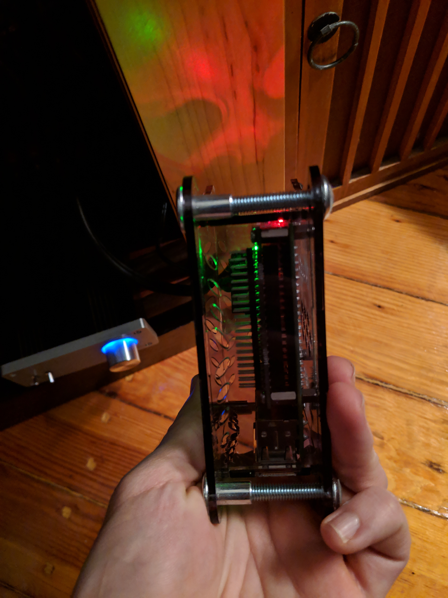
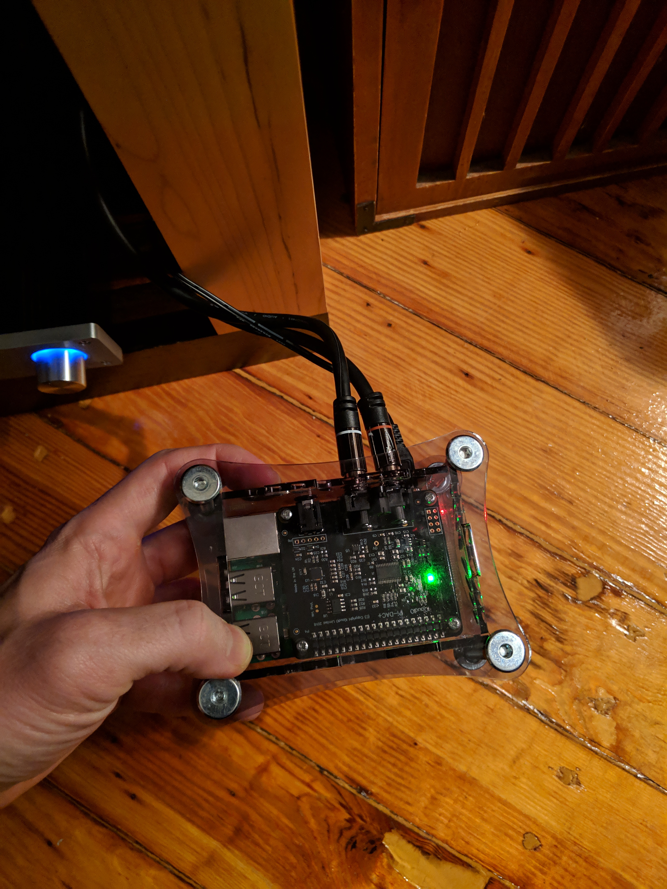

I had some free time in the holidays and I wanted to replace my really shady way to stream Spotify into my nice
bookshelf speakers. I use them mostly for my vinyl player, but I also want to have decent Spotify and a way to listen
to some lossless media I own. My goal was not to spend too much money (roughly around \$100), and had to be DYI, for fun.

<!--more-->

Previously, my setup was:

Chromecast -(HDMI)-> TV -(RCA cables)-> Amp -(speaker wire)-> Passive speakers

## Hardware

After some internet searching, I found out that Raspberry Pi's were good candidates for a media center, since it is
used as a video media center with things like [Kodi](https://kodi.tv/) or as a gaming setup with [Retropie](https://retropie.org.uk/).
I did a quick lookup and I found a ton of seemingly good quality DACs that can be attached on top of the Raspberry Pi as a HAT (a term for plugging an extension to a Pi via the GPIO),
avoiding transfering data over USB or other media that would run the Pi hot.

After looking up pros and cons of a bunch of the DACs available on [raspi.tv](https://raspi.tv/2016/dac-review) I went with the
[IQAudio's Pi-DAC+](http://iqaudio.co.uk/hats/8-pi-dac.html) for \$62, including the case and shipping. It got home in NYC pretty fast ( a week if I recall correctly). I also bought the Pi 3 Model B for another \$35.

For the complete setup, I just needed some extra [RCA cables](https://www.amazon.com/KabelDirekt-Analogue-Double-Shielded-Amplifiers-Receivers/dp/B00DI89I04/ref=sr_1_8?ie=UTF8&qid=1546640680&sr=8-8&keywords=RCA), which I got from Amazon, and an extra SD card I had lying around. To make things tidier, I also went a bit overboard and bought some [banana plugs from Mediabridge](https://www.amazon.com/Mediabridge-Banana-Plugs-Corrosion-Resistant-Gold-Plated/dp/B00JFC9BJU/ref=sr_1_4?ie=UTF8&qid=1546640851&sr=8-4&keywords=banana+plugs). Way better than having speaker wire mess.

And here's the flow:

Pi -(RCA cables)-> Amp -(speaker wire)-> Passive Speakers

Huge improvement, eh?

## Software

For audio-only, headless software, there aren't a lot of options for the Pi. It seems [RuneAudio](http://www.runeaudio.com/) is the best quality OS around but it hasn't seen updates since 2016, which is unfortunate. For quality it seems [Moode Audio](http://moodeaudio.org/) is great, but Spotify support is lacking, and required a ton of manual patching, which I would love to do if I were 25 again, when I ran Linux with my own patches in the kernel. Today I am too lazy.

Finally I ended up with [Volumio](https://volumio.org/). The setup was a breeze, my DAC was supported out-of-the-box, and it had a wifi hotstop for me to configure everything. The headless setup was great, so I didn't even had to plug a keyboard to the Pi. After configuring Spotify and loading my FLAC files, I just have to access its web page advertized via Bonjour or use Spotify directly. Pretty handy!

Here's how it looks with the whole thing assembled:

